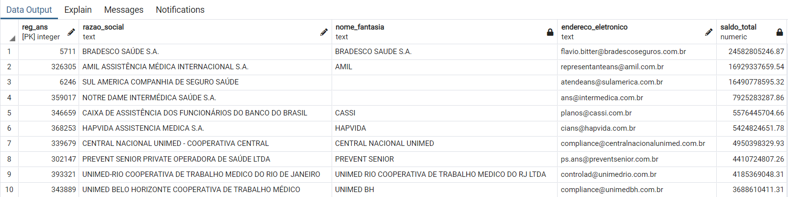

## Processo Seletivo - Intuitive Care

Esse repositório está divido em 4 pastas, cada um contém os arquivos necessários para realizar cada tarefa. Abaixo está uma explicação mais detalhada do que cada um contém:

> Nesse projeto, cada tarefa foi realizada em uma branch diferente, e cada pasta com códigos python contém um arquivo "requirements.txt" que contém todas as bibliotecas necessárias para o funcionamento correto dos códigos.

### [Task 1](https://github.com/tiagobpires/IntuitiveCare_selective_process/tree/main/task1)

[annex_scrapper.py](https://github.com/tiagobpires/IntuitiveCare_selective_process/blob/main/task1/annexes_scraper.py) contém uma classe que utiliza a biblioteca **requests** e **beautiful soup** para realizar requisições e o webscrapping. Além disos, utiliza **tempfile** para criar um diretório temporário, **shutil** para criação do arquivo zip, e expressões regulares para lidar com nome do arquivo.

[main.py](https://github.com/tiagobpires/IntuitiveCare_selective_process/blob/main/task1/main.py) cria a instância da classe e utiliza o método "scrape_documents", o qual recebe a lista de anexos para serem baixados, para criar o arquivo zip contendo todos os arquivos. Caso algo dê errado, uma exeção é criada informando o erro HTTP correspondente.

Pode-se ter um exemplo de arquivo zip gerado [aqui](https://github.com/tiagobpires/IntuitiveCare_selective_process/blob/main/task1/task1.zip).

### [Task 2](https://github.com/tiagobpires/IntuitiveCare_selective_process/tree/main/task2)

O arquivo "task1.zip" contido na pasta é o obtido na tarefa anterior.

[table_reader.py](https://github.com/tiagobpires/IntuitiveCare_selective_process/blob/main/task2/table_reader.py) contém a função para ler as tabelas, a qual utiliza a classe "TempDir", que cria e zipa diretórios temporários.

Recursos utilizados:
- **tabula** para ler tabelas em pdf
- **pandas** para manipular dados da tabela (utilizado na tarefa bônus)

[main.py](https://github.com/tiagobpires/IntuitiveCare_selective_process/blob/main/task2/main.py) utiliza a função **read_table** e passa os parâmetros necessários para customizar:

- Arquivo zip onde pdf serão extraídos
- Arquivo pdf
- Número das páginas para tabelas serem extraídas
- Nome do arquivo zip a ser criado
- Arquivo csv a ser criado

Pode-se ter um exemplo do arquivo zip criado [aqui](https://github.com/tiagobpires/IntuitiveCare_selective_process/blob/main/task2/Teste_Tiago.zip).

### [Task 3](https://github.com/tiagobpires/IntuitiveCare_selective_process/tree/main/task3)

- Utilização do PostgreSQL como SGBD.

[create.sql](https://github.com/tiagobpires/IntuitiveCare_selective_process/blob/main/task3/create.sql) contém as queries necessárias para criar as tabelas

[load_data.sql](https://github.com/tiagobpires/IntuitiveCare_selective_process/blob/main/task3/load_data.sql) carrega os dados do arquivo csv.

> Utilização do plpgsql para iterar sobre listas

[queries.sql](https://github.com/tiagobpires/IntuitiveCare_selective_process/blob/main/task3/queries.sql) contém as queries necessárias para responder as perguntas

- Quais as 10 operadoras que mais tiveram despesas com "EVENTOS/ SINISTROS CONHECIDOS OU AVISADOS  DE ASSISTÊNCIA A SAÚDE MEDICO HOSPITALAR" no último trimestre?

- Quais as 10 operadoras que mais tiveram despesas com "EVENTOS/ SINISTROS CONHECIDOS OU AVISADOS  DE ASSISTÊNCIA A SAÚDE MEDICO HOSPITALAR" no último ano?

### [Task 4](https://github.com/tiagobpires/IntuitiveCare_selective_process/tree/main/task4)

Criação de uma API que se conecta com o banco de dados criado anteriormente e realiza queries na tabela "relatórios_cadop".

Principais bibliotecas utilizadas:
- **Flask**
- **SQLAlchemy**: Conexão com banco de dados
- **Migrate**: Realizar alterações no banco de dados
- **SpecTree**: Documentação da API seguindo padrão Swagger e OpenAPI
- **Pydantic**: Validação das rotas

Arquivos:
- [config.py](https://github.com/tiagobpires/IntuitiveCare_selective_process/blob/main/task4/config.py): Classe Config com todas as configurações da aplicação.
- [models.py](https://github.com/tiagobpires/IntuitiveCare_selective_process/blob/main/task4/models.py): Modelo da tabela no banco de dados e esquemas para validação
- [routes.py](https://github.com/tiagobpires/IntuitiveCare_selective_process/blob/main/task4/routes.py): Rota para pesquisa no banco de dados. Contém múltiplos parâmetros de query que permitem realizar pesquisas mais específicas. Utilização de blueprint para melhor divisão da aplicação.
- [factory.py](https://github.com/tiagobpires/IntuitiveCare_selective_process/blob/main/task4/factory.py): Aplicação do Padrão "Aplication Factory": função para criação do aplicativo contendo todas as configurações necessárias.
- [main.py](https://github.com/tiagobpires/IntuitiveCare_selective_process/blob/main/task4/main.py): Roda aplicação.
- [Intuitive Care.postman_collection.json](https://github.com/tiagobpires/IntuitiveCare_selective_process/blob/main/task4/Intuitive%20Care.postman_collection.json): Coleção do PostMan com exemplo de requisição e parâmetros da query.

Exemplo de resultado da requisição no Postman:

Documentação Swagger (disponível em: docs/swagger)

> Na documentação temos acesso a todos os parâmetros possíveis e podemos realizar requisições por ela.

> Informações sobre resposta gerada pela documentação.

> Obs: Não coloquei a API no ar pois pode conter informações sensíveis nos csv. Porém, já possuo experiência com deploy no heroku, você pode checar meu projeto [Mini Feed API](https://github.com/tiagobpires/mini-feed) e [Readme Creator](https://readmecreator.herokuapp.com/).